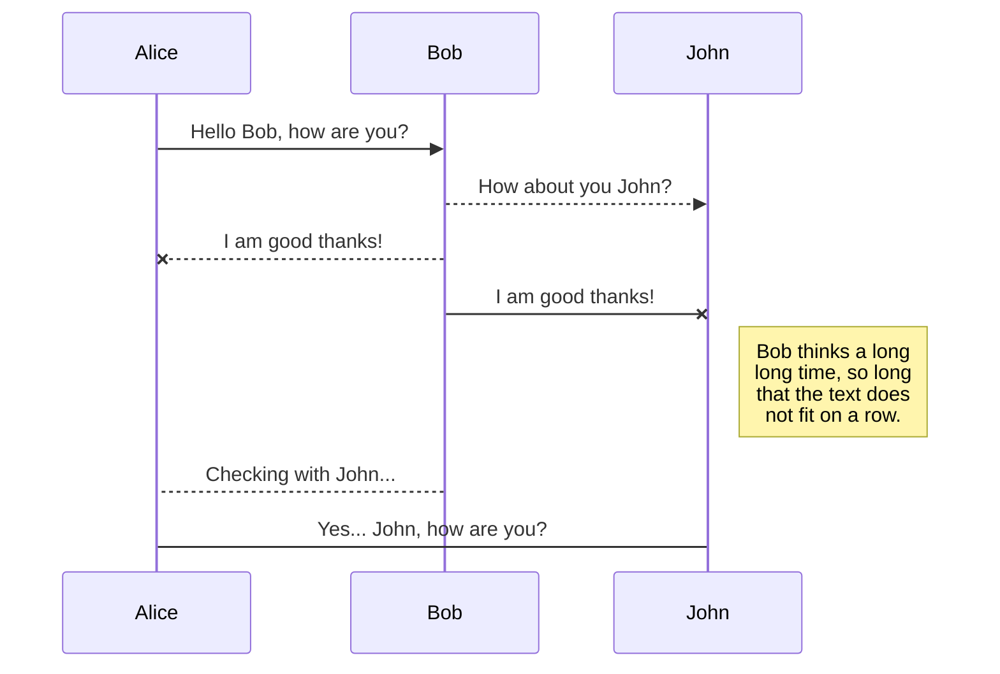
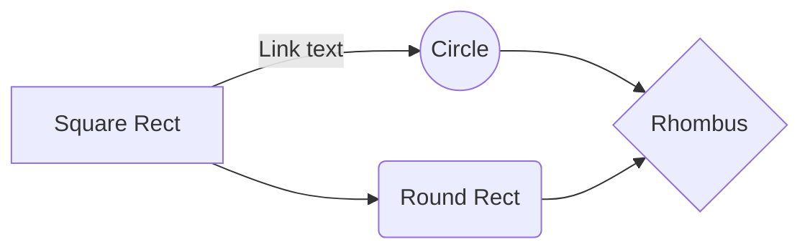

#  d3m0n os 

d3m0n OS is a Debian based ARM CPU architecture operating system. 

> :warning: This code is made to run on a d3m0n device only :warning:

## Partitions

> /[boot](https://github.com/d3m0n-project/d3m0n_os/tree/main/boot)		is a ext4 bootloader partition that contains the linux kernel and will make all this operating system work. It'll be located at /boot in [rootfs](https://github.com/d3m0n-project/d3m0n_os/tree/main/rootfs).
> 
> /[rootfs](https://github.com/d3m0n-project/d3m0n_os/tree/main/rootfs)	is the root partition, it contains call linux commands that d3m0n os needs to work.

## Installation

To execute this code and build your d3m0n os image (.img), you must execute these commands **line by line** in your linux machine terminal.

    sudo apt-get install git
    git clone https://github.com/d3m0n-project/d3m0n_os.git
    cd d3m0n_os
    sudo chmod +x *.sh && sudo chmod +x config
    sudo ./d3m0n.sh
then use numbers to select option you wan't

## Configure your OS

In order to build your image file (.img) you need first to install [d3m0n os](ps://github.com/d3m0n-project/d3m0n_os#installation) on your linux machine.
Then use the command `sudo ./d3m0n.sh` and type **2** and hit enter.
This will display a configuration window in your terminal.

## Flash a SD card with a image file

Install **BalenaEtcher** from [here](https://etcher.balena.io/#download-etcher) and select your image file (.img) 

Select your SD card drive

 And click **FLASH**

## Delete a file

You can delete the current file by clicking the **Remove** button in the file explorer. The file will be moved into the **Trash** folder and automatically deleted after 7 days of inactivity.

## Export a file

You can export the current file by clicking **Export to disk** in the menu. You can choose to export the file as plain Markdown, as HTML using a Handlebars template or as a PDF.

# d3m0n api

d3m0n operating system contains preinstalled softwares.
- d3m0n apps
  - photo
    - camera
    - gallery 
  - utils
    - calculator
    - settings
- system apps
   - touchscreen (touch screen handle software)

## Creating a d3m0n application

First create a main file named `app` and type these lines

    name: myapp
    package: com.myteam.myapp
    icon: /path/to/icon.png
    perms: none
    start_path: /path/to
    category: mycategory

### description
`name` is your new app name
`package` is your app 'id'
`icon` is then path to your icon (png) file or a theme icon ([theme-icons](#theme_icons))
`perms` can be equal to `sudo`(admin) or `none`(default)
`start_path` specifiate the directory where your app will be running
`category` is your app category

Then create a main layout file in the directory `layouts` named `main.layout`.

    # d3m0n layout << important!
	
	Window:
		name="My_Window"
		title="My window"
		width="200"
		height="100"
		bg_color="black"
	
	Text:
		content="my text"

create now a main source file in the directory `src` named `main.src`.

    # d3m0n source << important!
	
	# On app load
	Window.OnCreate => 
		# this is a comment
		myVariable="hello world"
		
		# create an alert box with myVariable content
		alert(myVariable);
		
		# write something in the host terminal in orange
		logn("[o] loaded myApp", "orange");
		
		# execute bash command
		system("echo test");
		
		# call a function called "myFunct" with args 'arg1' and 'arg2' in the dll
		[/path/to/myDll.dll,myNamespace,myclass,myFunct(arg1, arg2)]
	

	# on app quit
	Window.OnDestroy => 
		system("echo 'd3m0n path:         $d3m0n'");
		system("echo 'app ressource path: $ressource'");
		system("echo 'app source path:    $source'");
		system("echo 'app layouts path:   $layouts'");

	Element.OnClick => exec="python $source/main.py" 
	
this file will be executed in the same time that your layout one

# Apparence
Your system design can be changed to be fancier.

## theme_icons

Your d3m0n os apparence can be modified by using a theme.
These ones are located in 

> /usr/share/d3m0n/themes

## Manage file synchronization

Since one file can be synced with multiple locations, you can list and manage synchronized locations by clicking **File synchronization** in the **Synchronize** sub-menu. This allows you to list and remove synchronized locations that are linked to your file.

# Publication

Publishing in StackEdit makes it simple for you to publish online your files. Once you're happy with a file, you can publish it to different hosting platforms like **Blogger**, **Dropbox**, **Gist**, **GitHub**, **Google Drive**, **WordPress** and **Zendesk**. With [Handlebars templates](http://handlebarsjs.com/), you have full control over what you export.

> Before starting to publish, you must link an account in the **Publish** sub-menu.

## Publish a File

You can publish your file by opening the **Publish** sub-menu and by clicking **Publish to**. For some locations, you can choose between the following formats:

- Markdown: publish the Markdown text on a website that can interpret it (**GitHub** for instance),
- HTML: publish the file converted to HTML via a Handlebars template (on a blog for example).

## Update a publication

After publishing, StackEdit keeps your file linked to that publication which makes it easy for you to re-publish it. Once you have modified your file and you want to update your publication, click on the **Publish now** button in the navigation bar.

> **Note:** The **Publish now** button is disabled if your file has not been published yet.

## Manage file publication

Since one file can be published to multiple locations, you can list and manage publish locations by clicking **File publication** in the **Publish** sub-menu. This allows you to list and remove publication locations that are linked to your file.

# Markdown extensions

StackEdit extends the standard Markdown syntax by adding extra **Markdown extensions**, providing you with some nice features.

> **ProTip:** You can disable any **Markdown extension** in the **File properties** dialog.

## SmartyPants

SmartyPants converts ASCII punctuation characters into "smart" typographic punctuation HTML entities. For example:

|                |ASCII                          |HTML                         |
|----------------|-------------------------------|-----------------------------|
|Single backticks|`'Isn't this fun?'`            |'Isn't this fun?'            |
|Quotes          |`"Isn't this fun?"`            |"Isn't this fun?"            |
|Dashes          |`-- is en-dash, --- is em-dash`|-- is en-dash, --- is em-dash|

## KaTeX

You can render LaTeX mathematical expressions using [KaTeX](https://khan.github.io/KaTeX/):

The *Gamma function* satisfying $\Gamma(n) = (n-1)!\quad\forall n\in\mathbb N$ is via the Euler integral

$$
\Gamma(z) = \int_0^\infty t^{z-1}e^{-t}dt\,.
$$

> You can find more information about **LaTeX** mathematical expressions [here](http://meta.math.stackexchange.com/questions/5020/mathjax-basic-tutorial-and-quick-reference).

## UML diagrams

You can render UML diagrams using [Mermaid](https://mermaidjs.github.io/). For example, this will produce a sequence diagram:

And this will produce a flow chart:

