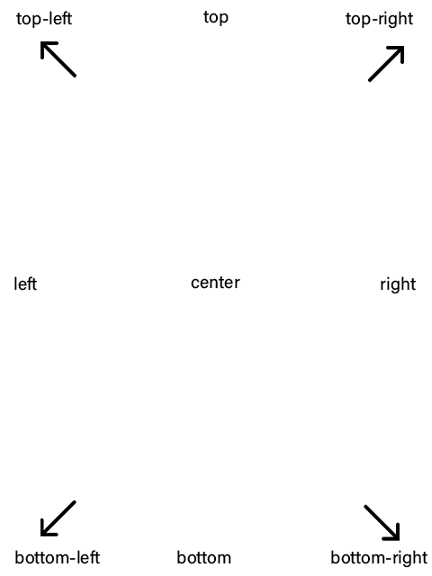

# General Attributes

These attributes can be applied to **every** controls.

    name="ControlName";
    visible="[true/false]";
    enabled="[true/false]";

    parent="ControlName";

    margin_top="10";
    margin_left="20";
    margin_right="5";
    margin_bottom="25";
    
    location="x, y";
    location="[top/top_left/top_right/bottom/bottom_left/bottom_right/left/right/center]";
    
    color="white";
    color="255, 255, 255";
    
    bg_color="black";
    bg_color="0, 0, 0";
    
    width="20";
    width="10%";
    
    height="10";
    width="5%";

## Description
`name` (string) is your control name/id

`visible` (bool) can show / hide your control (can be only **true** or **false**)

`enabled` (bool) define if events can be applied to this control

`parent` (string) define element parent by name (parent needs to be named

`margin_top`, `margin_right`, `margin_left`, `margin_bottom` (int) set margins of your control

`location` (int/string) is the place where your control will be (can be "**x, y**", "**top**", "**top_left**", "**top_right**", "**bottom**", "**bottom_left**", "**bottom_right**", "**left**", "**right**" or "**center**")

`color` (rgb/string) is your control foreground color (can be [a color](Colors.md) or a rgb color ex. "**255, 0, 80**")

`bg_color` (rgb/string) is your control background color (can be [a color](Colors.md) or a rgb color ex. "**255, 0, 80**")

`width` (int) and `height` (int) can only be positive numbers or percentage of the window size
